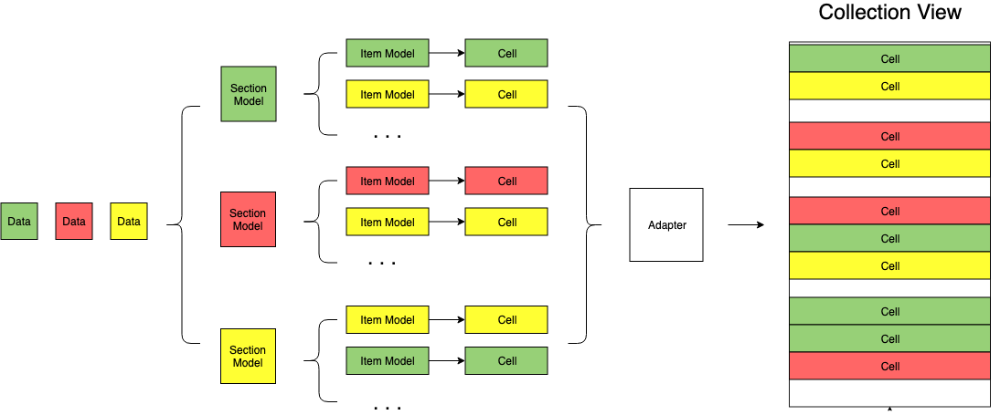

# NewYourTimes

*This is a demo for NYTimes APIs which applys **VIPER, POP, Core Data,** ...*

# VIPER
*This project will apply VIPER*

> VIPER is an application of Clean Architecture to iOS apps. The word VIPER is a backronym for View, Interactor, Presenter, Entity, and Routing.

* **View**: displays what it is told to by the Presenter and relays user input back to the Presenter.
* **Interactor**: contains the business logic as specified by a use case.
* **Presenter**: contains view logic for preparing content for display (as received from the Interactor) and for reacting to user inputs (by requesting new data from the Interactor).
* **Entity**: contains basic model objects used by the Interactor.
* **Routing**: contains navigation logic for describing which screens are shown in which order.

> I also use [Repository][0] pattern for `Data Access Layer`.

> [Learn more about VIPER and other iOS architectures...][1]

[0]:https://medium.com/tiendeo-tech/ios-repository-pattern-in-swift-85a8c62bf436
[1]:https://github.com/onmyway133/fantastic-ios-architecture#viper

---
# AVC Kit
With objectives are to write **reusable**, **maintainable** and **testable** code. I introduce a new way of using UICollectionView, **ACVKit**, a lightweight collection view.



As your can see, from our data models, we will break down into corresponding section models. A section model is backed by bunch of item models and each item is corresponding to a cell. And then thank to Adapter them can work with collection view. With this approach, you can easily reuse your cells, your items and your sections as well. 

For instance, you already have an section model that contains 3 items: **title**, **subtext**, **image**. And then you wanna create a new section that also contain **title**, so you can attach the title item directly into your new section model and BOOM!. That's it.

We can enject multiple types of section models. So we can make a collection view that shows multiple types of data as well. For instance, you making an application with having the newsfeed, so it's really nice to serve users with different types of content, such as: image, video or ... ads :D to make profit.

> Pls take a look at my source code for the reference.

## How to use
I already create an concrete class, `ACVViewController`, subclassing `UICollectionViewController`.

### Step 1:
Creat a new view controller that is inhereted `ACVViewController`. 
```swift
class HomeViewController: ACVViewController {
  /// Implementation
}
```
### Step2: 
Set `acvAdapter` **dataSource** and **delegate**(optional).
```swift
override func viewDidLoad() {
   ///
   acvAdapter.dataSource = self
}
 ```
### Step 3:
Conform `ACVAdapterDataSource` to your class
```swift
func sectionViewModelsForAdapter(_ adapter: ACVAdapter) -> [SectionViewModel] {
   // return your section models here
}
```
### Step 4:
Invoke `acvAdapter.performUpdate()` or `acvAdapter.reloadAllSections()` when has changes.
```swift
acvAdapter.performUpdate()
```

Create your section by comforming to `SectionViewModel` 

---
# Project Structure:
## 3 main folders:
### NewYourTimes
Contains App Bundle with 3 main folders:
* **Source** which contains all source code
* **Resources** which contains all resources such as: images, localizable strings,...
* **Supporting Files** which contains supporting files for the project: info.plist,...

  #### Source
  * **AppDelegate.swift** 
  * **UI**: contains all UI related code
    * **Custom**: contains all custom UI
    * **Shared**: contains all shared UIs using across modules
    * **Screens**: contains all in-app screens
  * **Components**: contains all backend related code
    * **Repositories**: contains all data access layers using in the project
    * ...
  * **Common**: contains constants and utility methods that uses in the project

### NewYourTimesTests
Contains Unit Tests

### NewYourTimesUITests
Contains UI Tests
